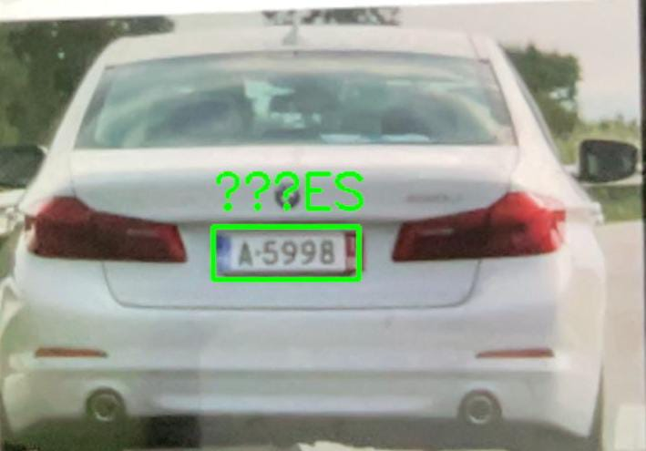

# 🚗 Real-Time License Plate Reader using YOLOv5 + Tesseract OCR

A real-time automatic license plate recognition (ALPR) system using [YOLOv5](https://github.com/ultralytics/yolov5) for detection and [Tesseract OCR](https://github.com/tesseract-ocr/tesseract) for text recognition. Built with Python and OpenCV, this project captures video from a webcam and identifies vehicle license plates in real-time.




---

## 📦 Features

- 🔍 Real-time license plate detection using YOLOv5
- 🔡 Plate text recognition using Tesseract OCR
- 🎥 Live webcam feed with bounding boxes
- 🧠 Easily extendable for alerting, logging, or blacklists

---

## 🧰 Requirements

Make sure you have **Python 3.8+** and [Homebrew](https://brew.sh/) installed (for macOS setup).

### 1. Install Dependencies

```bash
brew install tesseract
python3 -m venv lpr-env
source lpr-env/bin/activate
pip install --upgrade pip
pip install -r requirements.txt
```

### 2. Clone YOLOv5 (optional if using torch hub)

```bash
git clone https://github.com/ultralytics/yolov5.git
cd yolov5
pip install -r requirements.txt
cd ..
```

---

## 📁 Project Structure

```
license-plate-reader/
├── yolov5/                # YOLOv5 repo (optional if using torch hub)
├── best.pt                # YOLOv5 model trained to detect license plates
├── main.py                # Main script to run the app
├── requirements.txt       # Python dependencies
└── README.md              # This file
```

---

## 🔧 Setup Tesseract Path (macOS)

If Tesseract is not found automatically:

```python
# Add this to your Python code
pytesseract.pytesseract.tesseract_cmd = "/opt/homebrew/bin/tesseract"
```

---

## 🚀 Run the App

```bash
python main.py
```

Press `q` to quit the stream.

---

## 🎯 Example Output

When the script detects a plate, you'll see:
- Green bounding box around the plate
- OCR result printed on the frame

---

## 🧠 Train Your Own YOLOv5 Model

Use a dataset like [CCPD](https://github.com/detectRecog/CCPD) or [OpenALPR Benchmarks](https://github.com/openalpr/benchmarks) to fine-tune your own `best.pt`.

---

## 🧩 To Do / Ideas

- [ ] Save detected plates to CSV
- [ ] Add blacklist alert system
- [ ] Deploy via Flask or Streamlit
- [ ] Use RTSP stream from IP camera

---

## 📄 License

MIT License

---

## 🙌 Acknowledgments

- [Ultralytics YOLOv5](https://github.com/ultralytics/yolov5)
- [Tesseract OCR](https://github.com/tesseract-ocr/tesseract)
- [OpenCV](https://opencv.org/)
